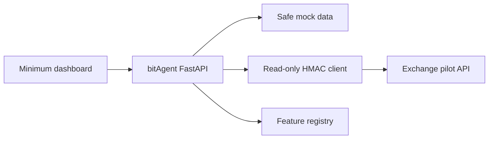

# Version 0 Architecture

## Components

## Request path

1. Browser requests `/api/v0/dashboard`.
2. In mock mode, bitAgent returns sanitized local fixtures.
3. In live mode, the connector creates a UUID and timestamp, builds the current
   pilot canonical string, signs it, and calls only an allowed `GET` endpoint.
4. The backend returns upstream evidence and a conservative deterministic signal.
5. The UI shows data and explicitly states what cannot yet be inferred.

## Modules

| Module | Responsibility |
|---|---|
| `app/main.py` | Versioned API, validation and UI delivery |
| `app/exchange.py` | Current read-only upstream signing and transport |
| `app/mock_data.py` | Safe local evaluation fixtures |
| `app/features.py` | Capability truth source |
| `app/static/` | Minimum operator dashboard |

## Trust boundaries

- The browser never receives the exchange token.
- The token is read by the backend from its runtime environment.
- User-level data is not shown on the initial dashboard.
- Mock mode is the default.
- Upstream operations are hard-coded as `GET`.
- Current HMAC compatibility is not considered production-safe until ADR-0002
  is implemented.
