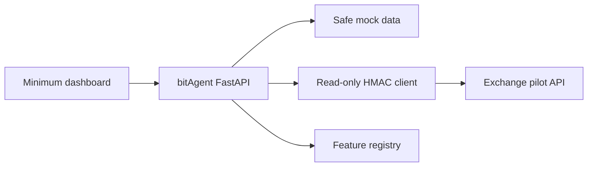

# Version 0 Architecture

## Components

## Request path

1. Browser requests `/api/v0/dashboard`.
2. In mock mode, bitAgent returns sanitized local fixtures.
3. In live mode, the connector creates a UUID and timestamp, normalizes the
   path, sorts and encodes query pairs, hashes the empty GET body, signs the
   API-contract v0.2 canonical request, and calls only an allowed `GET`
   endpoint.
4. The backend returns upstream evidence and a conservative deterministic signal.
5. The UI shows data and explicitly states what cannot yet be inferred.

## Modules

| Module | Responsibility |
|---|---|
| `app/main.py` | Versioned API, validation and UI delivery |
| `app/exchange.py` | Current read-only upstream signing and transport |
| `app/mock_data.py` | Safe local evaluation fixtures |
| `app/features.py` | Capability truth source |
| `app/static/` | Minimum operator dashboard |

## Trust boundaries

- The browser never receives the exchange signing secret.
- The key ID and signing secret are read by the backend from its runtime
  environment; only the public key ID crosses the network.
- User-level data is not shown on the initial dashboard.
- Mock mode is the default.
- Upstream operations are hard-coded as `GET`.
- Production use remains blocked until the exchange backend implements and
  validates ADR-0002 replay rejection, timestamp windows, scopes, rate limits,
  rotation, and revocation.
