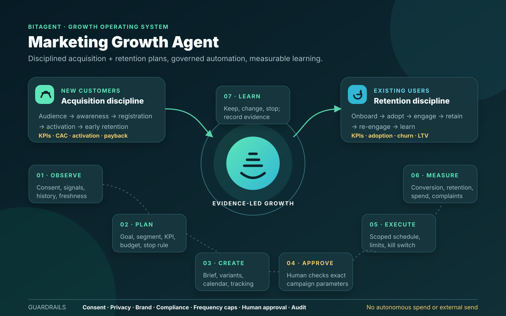

# Marketing Growth Agent — Feature and Delivery Plan

Proposed release: `1.9.0`

Operating mode: plan, draft, schedule, measure, and optimize with approval gates

Mission: create a repeatable marketing discipline for acquiring new customers
and retaining existing users without allowing uncontrolled messages, spend, or
audience changes.

## Outcomes

The Marketing Growth Agent will:

- turn business goals into measurable acquisition and retention plans;
- segment new prospects and existing users using approved, consented data;
- generate channel-specific campaign briefs, calendars, and draft content;
- automate approved workflows through a policy and approval gateway;
- measure funnel, activation, retention, re-engagement, and campaign results;
- recommend the next experiment using evidence rather than unsupported claims.

## Marketing discipline

Every campaign follows the same controlled loop:

1. **Observe:** validate consent, audience health, lifecycle signals, past
   performance, budget, and data freshness.
2. **Plan:** define objective, segment, customer promise, channel, cadence,
   owner, KPI, budget ceiling, and stop conditions.
3. **Create:** produce a campaign brief, content variants, landing-page
   requirements, tracking specification, and compliance checklist.
4. **Approve:** require named human approval for external publishing, sends,
   incentives, audience activation, or paid spend.
5. **Execute:** schedule only the exact approved campaign parameters through
   scoped connectors, with idempotency and a kill switch.
6. **Measure:** report delivery, conversion, activation, retention, opt-outs,
   complaints, spend, and experiment confidence.
7. **Learn:** record the result, recommend keep/change/stop, and feed approved
   lessons into the next plan.

## Separate customer programs

### New-customer acquisition

- Define ideal-customer profiles and approved audience segments.
- Map awareness, consideration, registration, verification, funding, and first
  successful use.
- Generate channel and campaign plans for organic, referral, partner, email,
  social, content, and paid acquisition.
- Create value-proposition and creative test matrices.
- Detect funnel drop-off and recommend onboarding improvements.
- Measure qualified acquisition, activation rate, cost per activated customer,
  payback period, and early retention.

### Existing-user growth and retention

- Define lifecycle stages: new, activating, active, at-risk, dormant, and
  reactivated.
- Generate onboarding, education, feature-adoption, loyalty, and re-engagement
  plans.
- Apply frequency caps and suppression rules across channels.
- Detect declining engagement using approved aggregate signals.
- Recommend next-best content or offer without exploiting sensitive traits.
- Measure feature adoption, repeat use, retention, churn, reactivation, and
  customer lifetime value.

## Todo list

### P0 — governance and data foundation

- [ ] Assign marketing, privacy, compliance, and data owners.
- [ ] Define permitted data, purpose, retention, residency, and consent rules.
- [ ] Create a canonical customer lifecycle and event taxonomy.
- [ ] Add tenant isolation, suppression lists, preference-center status, and
      right-to-erasure handling.
- [ ] Define prohibited targeting attributes and manipulative practices.
- [ ] Establish brand voice, claim substantiation, legal disclaimers, and
      channel policies.
- [ ] Define campaign, audience, content, experiment, and performance schemas.
- [ ] Create append-only audit records for plans, approvals, executions, and
      results.

### P1 — planning and content

- [ ] Generate quarterly strategy, monthly themes, and weekly campaign plans.
- [ ] Produce acquisition and retention plans separately.
- [ ] Generate campaign briefs with objective, audience, insight, promise,
      channel, CTA, owner, KPI, budget, and stop condition.
- [ ] Build an editable cross-channel calendar with dependency checks.
- [ ] Draft channel-specific content and creative specifications.
- [ ] Add factual-claim, brand, privacy, and compliance validation.
- [ ] Require source citations for market or product claims.
- [ ] Add localization workflow with native-speaker approval.

### P2 — governed automation

- [ ] Integrate approved CRM, analytics, email, social, advertising, and content
      systems using least-privilege credentials.
- [ ] Add deterministic audience eligibility, consent, suppression, and
      frequency-cap checks.
- [ ] Implement maker-checker approval for external campaigns.
- [ ] Bind approval to exact audience, content, channel, timing, budget, and
      experiment parameters.
- [ ] Add dry-run previews, test audiences, idempotency, expiry, rollback, and
      global pause controls.
- [ ] Schedule approved campaigns and verify downstream acceptance.
- [ ] Prevent autonomous budget increases, incentive changes, or expansion to
      a new audience.

### P3 — measurement and optimization

- [ ] Build acquisition, activation, engagement, retention, and reactivation
      funnels.
- [ ] Add campaign attribution with explicit model and uncertainty.
- [ ] Track spend, conversion, opt-out, complaint, and deliverability guardrails.
- [ ] Generate daily exceptions and weekly performance briefs.
- [ ] Recommend keep/change/stop decisions for experiments.
- [ ] Detect sample-ratio mismatch and premature experiment conclusions.
- [ ] Record human corrections and recommendation acceptance.
- [ ] Monitor performance drift by segment and channel.

## Version plan

| Version | Focus | Exit result |
|---|---|---|
| `1.9.0` | Foundation | Approved data boundaries, lifecycle taxonomy, campaign schemas, planning workflow, and audit trail |
| `1.9.1` | Acquisition planner | Evidence-backed acquisition plans, funnel definitions, content briefs, and KPI targets |
| `1.9.2` | Retention planner | Lifecycle segmentation, onboarding, adoption, retention, and re-engagement plans |
| `1.9.3` | Content studio | Governed multi-channel drafts, variants, brand checks, claims checks, and calendar |
| `1.9.4` | Measurement | Funnel reporting, attribution boundaries, experiment analysis, and performance briefs |
| `1.9.5` | Automation sandbox | Dry-run connectors, test audiences, exact-parameter approvals, rollback, and kill switch |
| `1.10.0` | Controlled pilot | Approved campaign scheduling for a limited audience and budget with monitoring |

## Automation boundaries

| Action | Initial state | Required control |
|---|---|---|
| Analyze aggregate campaign evidence | Enabled | RBAC, consent boundary, and audit |
| Generate plans, briefs, calendars, and drafts | Enabled | Sources, brand checks, and audit |
| Recommend an audience or budget | Enabled | Explainable rationale and human review |
| Create a campaign in draft state | Pilot | Scoped connector and exact-parameter preview |
| Send, publish, activate an audience, or spend funds | Disabled by default | Maker-checker approval, limits, verification, and kill switch |
| Increase budget or broaden targeting autonomously | Prohibited | New explicit approval |
| Use sensitive traits or contact people without consent | Prohibited | No exception |

## Release acceptance

- [ ] No campaign can reach an external audience without explicit approval.
- [ ] Consent, suppression, frequency, and tenant checks fail closed.
- [ ] Every recommendation identifies evidence, assumptions, and uncertainty.
- [ ] Every execution is bound to approved parameters and is auditable.
- [ ] Test-send, duplicate, expiry, partial-failure, rollback, and pause scenarios pass.
- [ ] Privacy, compliance, marketing, and security owners approve the pilot.

