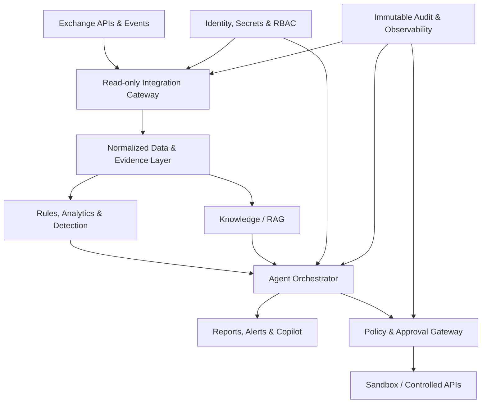

# bitAgent — Project Charter and 16-Week Delivery Plan

**Document status:** Approved starting baseline  
**Version:** 1.0  
**Date:** 29 July 2026  
**Project name:** bitAgent  
**Product working name:** Exchange Intelligence and Management Agent (XIMA)  
**Environment:** Existing production cryptocurrency exchange with API support  
**Delivery principle:** Read-only and advisory first; controlled actions only after validation and explicit human approval

---

## 1. Executive Summary

bitAgent is an AI-agent platform that observes, analyzes, explains, and eventually assists with the controlled management of an existing cryptocurrency exchange through its APIs.

The first release is deliberately **read-only**. It will aggregate operational, trading, treasury, compliance, security, customer-support, and business data; detect anomalies; produce evidence-backed recommendations; answer questions through a governed knowledge layer; and generate executive reports. It must not directly move funds, sign wallet transactions, alter balances, stop markets, or execute autonomous trading.

After the read-only system has demonstrated acceptable accuracy, security, auditability, and operational value, selected low-risk actions may be enabled through a policy engine and maker–checker approval workflow. Every recommendation, approval, API call, result, and exception will be recorded in an immutable audit trail.

The initial delivery horizon is **16 weeks**, ending with a production-limited pilot and a formal go/no-go decision for controlled-action capabilities.

---

## 2. Project Charter

### 2.1 Purpose

Create a governed intelligence and automation layer over the existing exchange so management and operational teams can:

- See exchange-wide health and risks in near real time.
- Detect incidents and abnormal behavior sooner.
- Investigate problems using joined evidence from multiple systems.
- Receive prioritized, explainable recommendations.
- Reduce repetitive reporting and operational analysis.
- Improve consistency of risk, AML, security, and support decisions.
- Introduce automation gradually without exposing customer funds or critical exchange controls to unsafe autonomous behavior.

### 2.2 Business Objectives

1. Establish a single operational intelligence view across the exchange.
2. Reduce mean time to detect and investigate important incidents.
3. Provide daily management, treasury, risk, AML, security, and support briefs.
4. Make every AI output traceable to source data, policy, model, prompt, and user.
5. Validate AI recommendations against historical and live read-only data.
6. Prepare a safe foundation for future human-approved actions.

### 2.3 Success Criteria

The 16-week pilot is successful when:

- All production connections used by the pilot are read-only and least-privilege.
- Critical data sources have documented owners, contracts, freshness targets, and quality checks.
- At least 95% of scheduled reports are generated within their service-level target.
- Critical alerts include supporting evidence, confidence, severity, and recommended next steps.
- No critical recommendation can bypass policy or approval controls.
- All user questions, retrieved evidence, model outputs, approvals, and tool/API operations are auditable.
- Role-based access, MFA, secrets management, encryption, and environment isolation pass security review.
- Evaluation suites meet agreed thresholds for groundedness, correctness, data leakage, and harmful-action refusal.
- Operations staff complete pilot acceptance and incident-response exercises.
- The steering committee signs the production-limited pilot acceptance report.

### 2.4 In Scope

- Exchange API and data-source inventory.
- Read-only API gateway and integration adapters.
- Operational health and incident intelligence.
- Market, liquidity, exposure, and risk monitoring.
- Treasury visibility and reconciliation support.
- AML/fraud prioritization and case-assistance.
- Cybersecurity signal correlation.
- Customer-support and knowledge/RAG assistance.
- Executive and departmental reporting.
- Policy, governance, approval, and audit services.
- Model/prompt registry, evaluation, monitoring, and rollback.
- Sandboxed simulation of proposed actions.
- Controlled-action framework design and limited pilot only after approval.

### 2.5 Out of Scope for the Initial Release

- Seed phrase or private-key access.
- Direct wallet signing.
- Autonomous withdrawal approval.
- Direct modification of customer balances.
- Unapproved transfer of customer or company funds.
- Autonomous market shutdown or trading halt.
- Fully autonomous market making or proprietary trading.
- Replacement of the exchange ledger, matching engine, wallet system, AML platform, or support platform.
- Final legal or regulatory judgment without an authorized human reviewer.

### 2.6 Constraints and Assumptions

- The exchange already exists and exposes APIs.
- API quality, documentation, and coverage will vary.
- Production writes remain disabled until a separate go/no-go approval.
- Sensitive data remains within approved boundaries and is minimized before model use.
- Deterministic controls and source systems remain authoritative; the LLM is not a system of record.
- Human owners remain accountable for operational and regulated decisions.
- The project requires representatives from operations, risk, treasury, AML/compliance, security, support, infrastructure, data, and engineering.

---

## 3. Product Principles

1. **Observe before acting.**
2. **Evidence before recommendation.**
3. **Deterministic rules before probabilistic judgment** for balances, limits, permissions, and transaction controls.
4. **Least privilege by default.**
5. **Human accountability for material actions.**
6. **No silent failure:** uncertainty, missing data, stale data, and tool errors must be visible.
7. **Immutable auditability.**
8. **Reversible rollout:** feature flags, canaries, kill switch, and rollback.
9. **Separation of duties:** requester, approver, and executor roles are distinct where risk requires it.
10. **Privacy and data minimization** across prompts, logs, embeddings, and reports.

---

## 4. Target Capabilities and Workstreams

| Workstream | Initial read-only capability | Later controlled capability |
|---|---|---|
| Operations | Service health, capacity, backlog, error and incident summaries | Approved runbook execution for low-risk recovery |
| Market & Risk | Spread, depth, volatility, exposure, concentration, abnormal trading alerts | Approved limit/configuration proposals |
| Treasury | Asset/liability view, hot-wallet thresholds, reconciliation exceptions | Approved internal rebalancing request creation; no direct signing |
| AML & Fraud | Case prioritization, pattern explanation, evidence summaries | Approved case routing or account-review requests |
| Security | Correlate authentication, WAF, infrastructure and admin events | Approved containment playbooks for predefined low-risk cases |
| Support | Ticket classification, answer drafting, escalation detection | Approved reply sending for eligible categories |
| Knowledge/RAG | Grounded answers from policies, runbooks, schemas and incidents | Curated knowledge-update workflow |
| Executive | Daily/weekly KPI, risk, incident and exception briefings | Approved distribution and follow-up task creation |
| Governance | Policy engine, RBAC, approvals, audit, evaluations | Maker–checker action gateway |

---

## 5. High-Level Architecture

### 5.1 Core Components

- **Integration gateway:** adapters, authentication, throttling, retries, timeouts, circuit breakers, schema validation, and read/write separation.
- **Evidence layer:** normalized events, metrics, snapshots, lineage, timestamps, freshness status, and source references.
- **Rules and analytics:** deterministic thresholds, anomaly detection, reconciliation, risk calculations, and business KPIs.
- **Knowledge/RAG:** approved policies, runbooks, API schemas, incident history, compliance procedures, and product documentation.
- **Agent orchestrator:** routes tasks to specialized agents, assembles evidence, applies guardrails, and manages workflows.
- **Policy/approval gateway:** classifies action risk, enforces permissions, checks prerequisites, collects approvals, and issues short-lived execution authorization.
- **Audit service:** append-only records of data access, prompts, model/tool versions, outputs, approvals, API calls, and outcomes.
- **Observability:** model quality, latency, cost, token use, tool failures, stale data, alert volume, and workflow completion.

---

## 6. Governance and Decision Rights

### 6.1 Steering Committee

Suggested membership:

- Executive sponsor
- Product owner
- Project manager
- CTO/engineering lead
- Operations lead
- Risk/treasury lead
- AML/compliance lead
- Security lead

Responsibilities:

- Approve scope, budget, risk acceptance, and production gates.
- Resolve cross-department priorities.
- Approve any transition from read-only to controlled actions.
- Review pilot results and decide go/no-go.

### 6.2 Core Roles

| Role | Primary accountability |
|---|---|
| Executive Sponsor | Funding, authority, strategic outcome |
| Product Owner | Backlog value, acceptance criteria, stakeholder alignment |
| Project Manager | Schedule, dependencies, RAID log, reporting, change control |
| Solution Architect | Architecture, boundaries, non-functional requirements |
| AI/ML Lead | Agent design, RAG, evaluations, model lifecycle |
| Data Engineer | Data contracts, pipelines, quality, lineage |
| Backend/Integration Engineer | API gateway, adapters, workflows |
| Security Engineer | Threat model, secrets, IAM, testing, incident controls |
| SRE/DevOps | Environments, CI/CD, observability, reliability |
| Domain Owners | Rules and acceptance for operations, risk, treasury, AML, support |
| QA/Evaluation Lead | Functional, safety, performance and regression testing |

### 6.3 RACI for Critical Decisions

| Decision | Sponsor | Product | Architecture | Security/Compliance | Domain Owner |
|---|---|---|---|---|---|
| Scope baseline | A | R | C | C | C |
| Architecture | I | C | A/R | C | C |
| Data access | I | C | R | A | C |
| Model release | I | A | R | C | C |
| Read-only pilot launch | A | R | C | C | C |
| Enable controlled action | A | R | C | A | R |
| Emergency kill switch | I | I | R | A | R |

**Legend:** R = Responsible, A = Accountable, C = Consulted, I = Informed.

---

## 7. Delivery Approach

- Two-week sprints with weekly cross-functional demos.
- One prioritized backlog with domain-specific epics.
- Architecture decisions recorded as ADRs.
- Definition of Ready includes owner, data source, risk level, acceptance criteria, and test data.
- Definition of Done includes code review, automated tests, security checks, documentation, observability, audit events, and owner acceptance.
- No feature reaches production without an evaluation report and rollback procedure.
- Changes to scope, production permissions, regulated workflows, or budget follow formal change control.

---

## 8. 16-Week Roadmap and Milestones

| Phase | Weeks | Main outcome | Exit milestone |
|---|---:|---|---|
| 0. Mobilize & Discover | 1–2 | Charter, inventory, prioritized use cases, baselines | M1: Scope and governance approved |
| 1. Secure Foundation | 3–4 | Environments, IAM, secrets, CI/CD, audit skeleton | M2: Security architecture approved |
| 2. Data & Integration | 5–6 | Read-only gateway, data contracts, evidence layer | M3: Core data sources validated |
| 3. Intelligence MVP | 7–8 | Operations, risk and executive read-only agents | M4: Internal alpha |
| 4. Domain Expansion | 9–10 | Treasury, AML/fraud, security, support and RAG | M5: Domain acceptance complete |
| 5. Governance & Evaluation | 11–12 | Policy engine, evaluation suite, red-team results | M6: Read-only release candidate |
| 6. Pilot & Hardening | 13–14 | Shadow mode, load/reliability tests, runbooks | M7: Production-limited pilot |
| 7. Controlled-Action Readiness | 15–16 | Approval gateway, sandbox actions, final decision | M8: Go/no-go and phase-2 backlog |

### Weeks 1–2 — Mobilize and Discover

- Confirm sponsor, product owner, project manager, technical lead, and domain owners.
- Validate charter, boundaries, objectives, KPIs, and budget assumptions.
- Inventory APIs, databases, Kafka topics, logs, monitoring, documents, and current workflows.
- Classify data by sensitivity, owner, retention, and permitted model use.
- Select the first 10–15 high-value read-only use cases.
- Establish baseline measures: incident detection time, reporting effort, alert quality, reconciliation exceptions, ticket volume.
- Create architecture context, threat model, initial data-flow diagram, RAID log, and stakeholder map.
- Define pilot users and production-limited scope.

**Deliverables:** signed charter, use-case scorecard, system/API inventory, data classification, initial architecture, threat model, KPI baseline, RAID log.

### Weeks 3–4 — Secure Foundation

- Create development, test, staging, and pilot environments.
- Implement SSO/MFA integration and RBAC roles.
- Establish a secrets vault and rotation process.
- Build CI/CD with code, dependency, container, and secret scanning.
- Establish model/prompt registry and configuration versioning.
- Implement append-only audit-event schema.
- Define logging redaction and prompt/data retention policies.
- Add feature flags and global kill switch.
- Produce incident-response and rollback skeletons.

**Deliverables:** environment baseline, IAM/RBAC matrix, secure CI/CD, secrets process, audit schema, logging standard, release checklist.

### Weeks 5–6 — Data and Integration Layer

- Build read-only adapters for the prioritized exchange APIs and event sources.
- Enforce separate credentials and network routes for read and future write operations.
- Implement timeouts, retries, rate limits, circuit breakers, and idempotency keys.
- Normalize operational, market, ledger-summary, wallet-summary, user-risk, AML, security, and support evidence.
- Define data contracts, schema versioning, freshness SLAs, lineage, and quality checks.
- Create a replayable sanitized test dataset.
- Implement access logging and per-source health dashboards.

**Deliverables:** read-only gateway, core adapters, normalized schemas, data-quality dashboard, sanitized replay dataset, integration test results.

### Weeks 7–8 — Intelligence MVP

- Build Operations Agent: incidents, capacity, errors, service dependencies, and runbook suggestions.
- Build Market/Risk Agent: liquidity, spreads, volatility, exposure, concentration, and abnormal activity.
- Build Executive Agent: daily KPI/risk/incident summary.
- Add evidence citations, confidence, severity, owner, and recommended next action to every output.
- Implement user feedback: correct, incorrect, incomplete, useful, not useful.
- Compare recommendations with historical incidents and expert decisions.
- Conduct internal alpha with a small authorized group.

**Deliverables:** three functioning read-only agents, alert/report UI or channel, evaluation baseline, internal-alpha feedback.

### Weeks 9–10 — Domain Expansion

- Add Treasury Agent for balances, obligations, wallet thresholds, and reconciliation exceptions.
- Add AML/Fraud Agent for case prioritization and evidence summarization.
- Add Security Agent for correlated authentication, admin, WAF, host, and application events.
- Add Support Agent for classification, drafting, sentiment/escalation, and knowledge retrieval.
- Build governed RAG ingestion for policies, runbooks, API docs, schemas, and approved incident records.
- Add document ownership, approval status, version, and expiration metadata.
- Complete domain-owner acceptance tests.

**Deliverables:** five domain capabilities, governed knowledge base, domain acceptance records, updated backlog.

### Weeks 11–12 — Governance, Safety and Evaluation

- Implement policy rules by role, domain, data class, environment, risk, and action.
- Define action risk levels: advisory, low, medium, high, prohibited.
- Implement prompt-injection, data-exfiltration, unsafe-action, and cross-tenant tests.
- Add groundedness, correctness, completeness, refusal, latency, and cost evaluations.
- Test stale/missing/conflicting data behavior.
- Conduct security testing, abuse-case review, and AI red-team exercises.
- Define model fallback and human escalation.
- Freeze the read-only release candidate.

**Deliverables:** policy engine, approval matrix, evaluation suite/report, red-team report, remediation log, release candidate.

### Weeks 13–14 — Shadow Pilot and Hardening

- Run in shadow mode beside existing teams without executing actions.
- Compare alerts and reports with actual operational outcomes.
- Tune thresholds and suppress duplicate/noisy alerts.
- Perform load, soak, resilience, disaster-recovery, and failover tests.
- Verify backup, restore, monitoring, on-call, and escalation runbooks.
- Train pilot users and approvers.
- Complete privacy, compliance, security, and operational readiness reviews.

**Deliverables:** pilot metrics, reliability report, tuned rules, runbooks, training records, production-limited pilot acceptance.

### Weeks 15–16 — Controlled-Action Readiness

- Build maker–checker approval workflow.
- Require action preview: target, parameters, expected effect, risk, evidence, and rollback.
- Add short-lived signed authorization, idempotency, execution timeout, and result verification.
- Run proposed actions only in sandbox or non-production.
- Test rejection, expiry, duplicate request, partial failure, rollback, and kill switch.
- Review benefits, errors, risks, operational readiness, and total cost.
- Decide: remain read-only, enable a small low-risk action set, or remediate and reassess.

**Deliverables:** sandbox action gateway, approval UI/workflow, action audit trail, final KPI report, go/no-go decision, phase-2 roadmap.

---

## 9. Initial Product Backlog

### Epic A — Platform and Integration

- API catalog with owner, endpoint, permission, rate limit, SLA, and data class.
- Read-only credential issuance and rotation.
- Adapter SDK and common error model.
- Schema registry and contract tests.
- Event ingestion and replay.
- Cache and freshness indicators.
- Tool execution timeout and circuit breaker.
- Per-source observability.

### Epic B — Operations Intelligence

- Service dependency map.
- Error-rate and latency anomaly detection.
- Queue/backlog and capacity alerts.
- Incident timeline assembly.
- Similar-incident retrieval.
- Runbook recommendation.
- Daily operations brief.

### Epic C — Market, Liquidity and Risk

- Spread/depth/volume dashboards.
- Exposure by asset, market, account type, and venue.
- Concentration and counterparty indicators.
- Volatility and abnormal-trading detection.
- Limit breach explanation.
- Market-quality daily report.

### Epic D — Treasury and Reconciliation

- Asset/liability and wallet summary.
- Hot-wallet threshold monitoring.
- Deposit/withdrawal exception summary.
- Ledger/wallet/external-source reconciliation evidence.
- Unresolved obligation and aging report.
- Treasury daily brief.

### Epic E — AML, Fraud and Compliance

- Case priority score with transparent factors.
- Linked-account and behavioral pattern summary.
- Deposit/withdrawal risk evidence pack.
- Case-note drafting.
- False-positive feedback capture.
- Compliance daily queue brief.

### Epic F — Security

- Authentication and admin activity correlation.
- Privileged-action monitoring.
- WAF, host, application, and IAM incident summary.
- Suspicious access narrative.
- Security case escalation.
- Security daily brief.

### Epic G — Support and Knowledge

- Ticket intent and urgency classification.
- Account-safe response drafting.
- Escalation and dissatisfaction detection.
- Grounded knowledge answers with citations.
- Knowledge review and expiry workflow.
- Agent feedback and correction capture.

### Epic H — Governance, Audit and Model Operations

- RBAC and separation of duties.
- Policy engine and prohibited-action rules.
- Maker–checker workflow.
- Append-only audit events.
- Prompt/model/tool registry.
- Offline and online evaluations.
- Drift, quality, latency and cost dashboards.
- Feature flags, kill switch, rollback.

---

## 10. Approval and Action-Control Model

### 10.1 Action Classes

| Class | Example | Initial status | Required control |
|---|---|---|---|
| A0: Information | Search, summarize, explain | Enabled | RBAC + audit |
| A1: Recommendation | Suggest investigation or configuration | Enabled | Evidence + confidence + audit |
| A2: Draft | Prepare ticket, reply, case note or change request | Pilot | Human review before use |
| A3: Low-risk action | Create internal task, acknowledge eligible alert | Disabled until gate | Maker–checker or policy-approved single checker |
| A4: Material action | Change limits/config, restrict account, operational intervention | Prohibited in initial release | Separate future approval and strict maker–checker |
| A5: Fund/ledger/market-critical | Sign wallet transaction, move funds, modify balance, autonomous withdrawal, stop market | Prohibited | Outside initial project |

### 10.2 Controlled-Action Sequence

1. Agent creates a proposed action.
2. Deterministic validation checks schema, permissions, current state, limits, and prerequisites.
3. Policy engine assigns risk and required approvers.
4. Human sees evidence, expected result, impact, and rollback.
5. Approval is time-limited and bound to exact parameters.
6. Executor uses a separate scoped credential.
7. Result is verified against the source system.
8. Full record is written to the immutable audit trail.
9. Failure triggers rollback or human escalation; the kill switch remains available.

---

## 11. Security, Privacy and Compliance Plan

- Zero-trust access and least-privilege service identities.
- Separate read and write credentials, networks, and runtime paths.
- MFA for privileged users and approvers.
- Encryption in transit and at rest.
- Central secrets management; no secrets in prompts, code, logs, or vector stores.
- Prompt and output redaction for credentials and unnecessary personal data.
- Data residency, retention, deletion, and access policies by data class.
- Tenant/user isolation and authorization checks at every retrieval and tool call.
- Approved-source allowlist for RAG.
- Defenses against prompt injection in documents, tickets, logs, and API payloads.
- Software supply-chain scanning and signed artifacts.
- Security monitoring for agent, tool, approval, and administrative activity.
- Formal threat modeling and abuse-case review before each release gate.
- Legal/compliance owner signs off on AML and personal-data use.

---

## 12. Testing and Evaluation Strategy

### 12.1 Test Layers

- Unit and schema tests.
- API contract and integration tests.
- Historical replay and golden-case tests.
- RAG retrieval and citation tests.
- Deterministic calculation comparison tests.
- Role/permission and cross-boundary tests.
- Prompt injection and adversarial tests.
- Load, latency, soak, failover, and disaster-recovery tests.
- Human domain-expert review.
- Shadow-mode comparison against real outcomes.

### 12.2 Core AI Metrics

- Groundedness and citation validity.
- Factual and numerical correctness.
- Completeness of important evidence.
- False-positive and false-negative rates by alert type.
- Correct refusal of prohibited actions.
- Escalation accuracy.
- User acceptance/correction rate.
- Latency, availability, and cost per workflow.
- Data freshness at decision time.

### 12.3 Release Gates

| Gate | Required evidence |
|---|---|
| Development to staging | Automated tests, security scans, audit events, documentation |
| Staging to read-only pilot | Domain acceptance, red-team completion, rollback/runbooks, KPI baseline |
| Read-only to controlled-action sandbox | Policy and approval tests, exact-parameter authorization, failure/rollback tests |
| Sandbox to production action | Separate steering and security/compliance approval; not automatic after week 16 |

---

## 13. Key Performance Indicators

### Business and Operational

- Reduction in time spent producing daily/weekly reports.
- Mean time to detect and investigate incidents.
- Percentage of material incidents detected or summarized by bitAgent.
- Reconciliation exception resolution time.
- AML/fraud case-review productivity.
- Support draft acceptance and escalation accuracy.
- User satisfaction and weekly active pilot users.

### Quality and Safety

- Recommendation acceptance/correction rate.
- Groundedness and citation accuracy.
- Critical false-negative count.
- Unsafe/prohibited action attempts blocked.
- Unauthorized data-access incidents: target zero.
- Auditable workflow coverage: target 100%.
- Stale-data decisions blocked or clearly flagged.

### Platform

- Availability and scheduled-report success rate.
- P95 workflow latency.
- Data-source freshness compliance.
- Tool/API failure rate.
- Cost per report, investigation, and active user.

---

## 14. Risk Register

| ID | Risk | Probability | Impact | Primary mitigation | Owner |
|---|---|---:|---:|---|---|
| R1 | Incorrect AI recommendation affects operations | M | H | Read-only first, evidence, confidence, expert review, evaluations | AI Lead |
| R2 | Unauthorized or excessive API permissions | M | Critical | Least privilege, separate credentials, network controls, periodic review | Security |
| R3 | Sensitive data leakage through prompts/logs/RAG | M | Critical | Minimization, redaction, encryption, retention policy, access tests | Security/Compliance |
| R4 | Poor or stale source data | H | H | Contracts, freshness markers, quality gates, fail closed on critical workflows | Data Lead |
| R5 | Prompt injection through untrusted content | H | H | Source trust labels, content isolation, tool policy, adversarial testing | Security/AI |
| R6 | Alert fatigue and low adoption | M | H | Prioritization, deduplication, feedback, phased rollout | Product/Operations |
| R7 | API changes or insufficient documentation | H | M | Adapter layer, contract tests, versioning, API owner assignment | Integration Lead |
| R8 | Lack of domain-owner time | M | H | Named owners, scheduled acceptance sessions, steering escalation | Sponsor |
| R9 | Model/provider outage or quality change | M | H | Fallback models, caching, circuit breakers, evaluation before upgrades | AI/SRE |
| R10 | Excessive latency or cost | M | M | Routing, smaller models for routine work, budgets, caching, monitoring | AI Lead |
| R11 | Audit trail incomplete or mutable | L | Critical | Append-only design, integrity checks, restricted access, retention | Security |
| R12 | Premature pressure for autonomous actions | M | Critical | Charter exclusions, formal gates, prohibited-action policy, steering approval | Sponsor |
| R13 | Cross-user or cross-domain data exposure | L | Critical | Scoped retrieval, RBAC/ABAC, isolation tests, audit | Architecture/Security |
| R14 | Regulatory interpretation changes | M | H | Compliance review, configurable policies, no autonomous legal decisions | Compliance |
| R15 | Pilot cannot demonstrate measurable value | M | H | Baselines in weeks 1–2, prioritized use cases, weekly review | Product |

---

## 15. Project Management Plan

### 15.1 Cadence

- Daily engineering stand-up.
- Weekly product/domain review and demo.
- Weekly risk and dependency review.
- Biweekly sprint planning and retrospective.
- Biweekly steering summary; weekly during pilot.
- Immediate escalation for critical security, privacy, fund-safety, or compliance issues.

### 15.2 Core Project Artifacts

- Charter and scope baseline.
- Product backlog and release plan.
- Architecture and ADR register.
- API/data catalog and data-classification register.
- RAID log: risks, assumptions, issues, dependencies.
- Decision log.
- Security threat model.
- Evaluation plan and reports.
- Test and acceptance records.
- Runbooks and rollback procedures.
- Training and change-management materials.
- Pilot report and go/no-go record.

### 15.3 Change Control

A change request is mandatory when a proposal:

- Adds a production write permission.
- Enables a new action class.
- Uses a new category of sensitive data.
- Changes a critical model, provider, or hosting boundary.
- Affects wallet, ledger, withdrawal, market, AML, or security controls.
- Changes schedule or budget beyond the approved tolerance.

The request records rationale, value, security/compliance impact, cost, schedule, tests, rollback, and required approvers.

### 15.4 Communication

| Audience | Content | Frequency |
|---|---|---|
| Delivery team | Tasks, blockers, test results | Daily |
| Domain owners | Demo, accuracy, acceptance, corrections | Weekly |
| Steering committee | Progress, KPIs, budget, risks, decisions | Biweekly |
| Pilot users | Release notes, known limitations, feedback | Each release |
| Security/compliance | Access, incidents, exceptions, gate evidence | Weekly and on incident |

---

## 16. Resource and Budget Planning Assumptions

Minimum cross-functional team:

- 1 product owner
- 1 project manager/business analyst
- 1 solution architect/technical lead
- 2 backend/integration engineers
- 1–2 AI/ML engineers
- 1 data engineer
- 1 frontend engineer, part or full time
- 1 DevOps/SRE engineer
- 1 QA/evaluation engineer
- Security and domain specialists part time

Budget categories:

- Engineering and domain-owner time.
- Compute, model inference, embeddings, storage, and observability.
- Security tooling and testing.
- Staging/test infrastructure.
- Training and change management.
- Contingency for API remediation and data-quality work.

A detailed monetary budget will be created after the week-2 API/data inventory and selected model/deployment architecture.

---

## 17. Immediate Start Checklist

### First 48 Hours

- [ ] Name the executive sponsor, product owner, PM, technical lead, and domain owners.
- [ ] Create the project workspace, backlog, decision log, RAID log, and document repository.
- [ ] Freeze the read-only-first and prohibited-action rules in the charter.
- [ ] Schedule discovery workshops with operations, risk, treasury, AML, security, support, infrastructure, and exchange developers.
- [ ] Request read-only API documentation and test credentials.

### First Week

- [ ] Complete system/API/event/document inventory.
- [ ] Classify data and define access owners.
- [ ] Score and select 10–15 use cases by value, feasibility, risk, and data readiness.
- [ ] Baseline current operational KPIs and reporting effort.
- [ ] Draft architecture, threat model, and environment plan.
- [ ] Define pilot users and acceptance criteria.

### By End of Week Two

- [ ] Obtain signed charter and scope.
- [ ] Approve the prioritized backlog and 16-week milestones.
- [ ] Approve security, privacy, audit, and environment requirements.
- [ ] Confirm staffing and budget envelope.
- [ ] Create sprint 1 and sprint 2 detailed tasks.
- [ ] Hold milestone M1 review.

---

## 18. Initial Use-Case Prioritization Method

Score each proposed use case from 1–5:

| Criterion | Weight |
|---|---:|
| Business/operational value | 25% |
| Risk reduction | 20% |
| Data readiness | 15% |
| Feasibility within 16 weeks | 15% |
| Measurability | 10% |
| User adoption likelihood | 10% |
| Low implementation/action risk | 5% |

Prioritize high-scoring read-only workflows with clear owners and measurable current baselines. Defer workflows that require wallet signing, ledger mutation, autonomous trading, or unclear regulated decisions.

---

## 19. Definition of Pilot Completion

The project’s first stage is complete when:

1. The read-only system is operating for the approved pilot users and sources.
2. Operations, risk, treasury, AML, security, support, knowledge/RAG, and executive reporting have documented acceptance results.
3. Security, privacy, reliability, and AI evaluation gates are passed or formally risk-accepted.
4. All outputs and workflow steps are auditable.
5. Training, support, on-call, incident, and rollback arrangements are active.
6. The steering committee receives measured results against the week-1 baseline.
7. A documented decision is made to:
   - continue read-only and optimize;
   - begin a tightly limited controlled-action phase; or
   - remediate specific gaps before proceeding.

---

## 20. Baseline Decision Register

| Decision | Status |
|---|---|
| Project name is **bitAgent** | Approved |
| Working product name is **Exchange Intelligence and Management Agent (XIMA)** | Working label |
| Existing exchange and APIs are reused | Approved |
| First production release is read-only/advisory | Approved |
| Material actions require explicit human approval | Approved |
| Maker–checker is the default for controlled actions | Approved |
| Direct wallet signing and private-key access are excluded | Approved |
| Autonomous withdrawal, balance modification, fund transfer, market shutdown, and fully autonomous trading are excluded | Approved |
| Immutable audit is required | Approved |
| Initial delivery horizon is 16 weeks | Approved |
| Controlled-action enablement requires a separate go/no-go decision | Approved |

