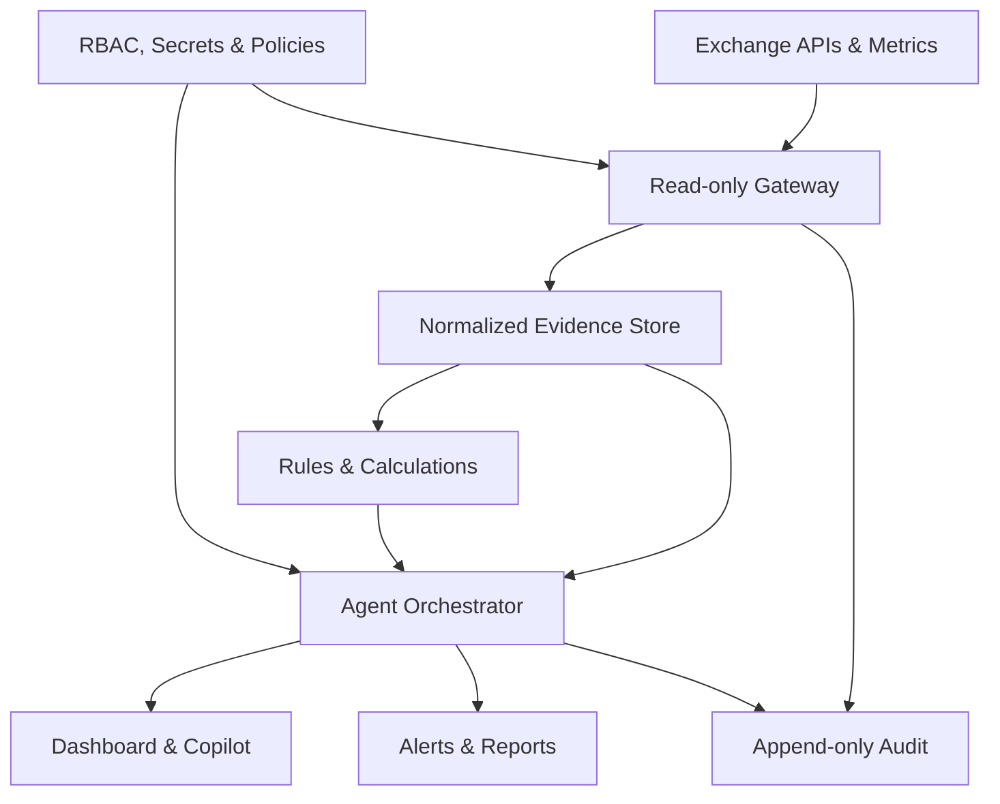

# bitAgent — Master MVP Runbook

**Status:** Approved starting baseline  
**Version:** 1.0  
**Date:** 29 July 2026  
**Repository:** `https://github.com/jafarvand/bitagent`  
**System:** Existing cryptocurrency exchange with backend API support  
**Primary rule:** Read-only first. No autonomous action affecting funds, users, markets, balances, or production configuration.

---

## 1. Purpose

This is the single starting runbook for the bitAgent project. It consolidates the project charter, first MVP, technical baseline, integration requirements, API-security corrections, implementation milestones, operating procedures, tests, risks, acceptance criteria, and next actions.

bitAgent is an AI-assisted operations and risk platform for an existing cryptocurrency exchange. It collects evidence from approved read-only sources, runs deterministic calculations and rules, correlates incidents, answers authorized questions, recommends investigation steps, and generates auditable reports.

The AI may explain and prioritize evidence. It must not be the authoritative calculator for balances, liabilities, exposure, reconciliation, or alert thresholds. Those results must come from deterministic, independently tested code.

---

## 2. Non-negotiable safety boundaries

### Allowed in the first MVP

- Read approved exchange APIs.
- Read sanitized operational metrics and logs.
- Normalize and store evidence.
- Calculate health, liquidity, exposure, and reconciliation metrics.
- Detect configured anomalies.
- Correlate related alerts.
- Answer authorized natural-language questions.
- Recommend runbooks and investigation steps.
- Generate dashboards, alerts, and daily reports.
- Record all access, calculations, prompts, outputs, and errors.

### Prohibited in the first MVP

- Place, cancel, or modify orders.
- Execute market-making or arbitrage.
- Move or transfer funds.
- Sign wallet or blockchain transactions.
- Approve or reject deposits or withdrawals.
- Change customer balances.
- Block, suspend, or modify users.
- Change exchange or infrastructure configuration.
- Restart services or remediate incidents automatically.
- Access private keys, seed phrases, or signing systems.
- Replace the exchange AML case-management system.

Any future action capability requires a separate security review, policy controls, maker-checker approval, simulation, bounded permissions, rollback design, and steering-committee approval.

---

## 3. First MVP definition

### Product

An **8-week read-only Exchange Operations and Risk Copilot**, delivered as the first phase of the wider 16-week bitAgent program.

### Primary pilot

Detect and investigate a deposit or withdrawal processing slowdown:

1. Detect rising queue depth or transaction age.
2. Correlate it with API latency, worker heartbeat, network status, and errors.
3. Identify affected assets, networks, and transaction counts.
4. Calculate oldest and average processing age.
5. Produce an evidence-backed incident summary.
6. Recommend the correct runbook.
7. Notify the responsible operator through the approved channel.
8. Include the event in the executive report.
9. Audit the entire process.

### Target users

| Role | Main use |
|---|---|
| Exchange Operations | Service, queue, worker, deposit, and withdrawal monitoring |
| Risk Manager | Liquidity, exposure, concentration, and unusual-activity monitoring |
| Treasury Manager | Wallet visibility and asset/liability reconciliation |
| CTO/SRE | Evidence-based incident investigation |
| CEO/Management | Daily exchange-health and priority brief |
| Security/Auditor | Review access, evidence, prompts, outputs, and policy compliance |

### MVP outputs

- Operations health dashboard.
- Market and liquidity dashboard.
- Treasury and liability summary.
- Deposit/withdrawal exception list.
- Ten to fifteen deterministic alert rules.
- Evidence-backed incident summaries.
- Natural-language investigation interface.
- Daily executive report.
- Append-only audit trail.
- User feedback/correction mechanism.

---

## 4. Required input package

Prepare the following without real secrets:

```text
integration-input/
├── openapi.yaml
├── postman-collection.json
├── endpoint-inventory.xlsx
├── sample-responses/
│   ├── health.json
│   ├── markets.json
│   ├── wallets.json
│   ├── liabilities.json
│   ├── deposits.json
│   └── withdrawals.json
├── data-dictionary.md
├── alert-thresholds.yaml
├── known-incidents/
└── runbooks/
```

### Documentation required

- API base URLs per environment.
- Endpoint paths and HTTP methods.
- Parameters, pagination, sorting, filters, and limits.
- Full request and response schemas.
- Authentication and signing protocol.
- Rate limits, timeouts, and retry guidance.
- Error codes and structured error responses.
- Timestamp and timezone conventions.
- Sanitized healthy and degraded response examples.
- Data owners and escalation contacts.

### Operational context required

- Backend technology and version.
- Staging availability.
- Authentication type.
- Existing Kafka or queue system.
- Monitoring stack: Prometheus, Grafana, ELK/Loki, Sentry, etc.
- Database types.
- Deployment platform: Docker, Kubernetes, or VMs.
- Approved notification channel.
- Operations, treasury, security, and risk owners.

---

## 5. Read-only account checklist

The bitAgent service account must have:

- Explicit read scopes only.
- No generic admin role.
- No POST, PUT, PATCH, or DELETE permissions.
- No trade, transfer, withdrawal, balance, user, or configuration scopes.
- Separate credentials for development, staging, and production.
- Immediate revocation and documented rotation.
- IP allowlisting where possible.
- TLS-only connectivity.
- Per-key rate limits.
- Server-side authentication and authorization logs.
- Token/secret stored only in an approved secret manager.

Never put a real token or secret in ChatGPT, GitHub, screenshots, documentation, source code, exported Postman collections, issue trackers, or ordinary log files.

Before production use, perform negative tests against prohibited endpoints and verify they all return authorization failures.

---

## 6. API authentication contract v0.2

### Required redesign

Do not transmit the shared HMAC secret in an authorization header. Use a public key identifier and keep the secret on the client and server only.

Required headers:

```http
X-Bot-Key-ID: bitagent-pilot-01
X-Request-Timestamp: 1785350000
X-Request-ID: <UUID>
X-Request-Signature: <HMAC-SHA256>
```

Canonical signed content:

```text
METHOD
NORMALIZED_PATH
SORTED_QUERY_STRING
TIMESTAMP
REQUEST_ID
BODY_SHA256
```

Server rules:

- Look up the secret using `X-Bot-Key-ID`.
- Never accept the secret over the network.
- Reject timestamps outside the allowed window, initially 60 seconds.
- Store recent request IDs and reject replays.
- Use constant-time signature comparison.
- Reject unknown, disabled, expired, or wrong-scope keys.
- Apply per-key and per-IP rate limits.
- Log key ID, request ID, route, decision, latency, and reason—not the secret.
- Support overlapping keys for safe rotation.
- Allow immediate revocation.

### Required error responses

Use one structured error schema for:

| Status | Meaning |
|---:|---|
| 400 | Invalid request or date range |
| 401 | Missing/invalid signature |
| 403 | IP or scope denied |
| 404 | Entity not found |
| 409 | Replayed request ID |
| 422 | Invalid parameter |
| 429 | Rate limit exceeded |
| 500 | Internal error |
| 502 | Dependency error |
| 503 | Service/auth dependency unavailable |

---

## 7. API-contract quality requirements

- Complete response schema for every endpoint.
- Explicit `required` arrays for stable fields.
- Decimal financial values represented as strings.
- ISO 8601 UTC timestamps, preferably `2026-07-29T18:18:43Z`.
- OpenAPI 3.0 nullable values use `nullable: true`; alternatively adopt OpenAPI 3.1.
- Cursor pagination for unbounded collections.
- Deterministic sort order.
- Maximum page size.
- `next_cursor` in responses.
- Correlation/request ID in every response.
- `generated_at` and source-data freshness in every response.
- Consistent `data`, `meta`, and `errors` envelope.
- Versioned API contract and changelog.
- Runtime response-schema validation.

### Postman requirements

- Use `{{user_id}}` and date variables.
- Keep secrets only in a private environment.
- Include the sorted query string in the signature.
- Test status, schema, request-ID match, and freshness.
- Add response-time assertions.
- Add negative tests for missing signature, expired timestamp, replay, wrong IP, and wrong scope.

---

## 8. Minimum endpoints

### Existing individual-user investigation endpoints

Retain the already reviewed eight read-only endpoints, but complete their schemas, pagination, errors, and security contract. Individual-user endpoints are useful for investigation but are not sufficient for exchange-wide detection.

### Required operational endpoints

| Endpoint | Minimum output |
|---|---|
| `GET /api/bot/health` | Service/dependency status, latency, last success |
| `GET /api/bot/transactions/summary` | Counts and age by type, status, asset, network |
| `GET /api/bot/withdrawals/pending` | Paginated delayed/active withdrawals |
| `GET /api/bot/deposits/pending` | Paginated delayed/active deposits |
| `GET /api/bot/networks/status` | Node/wallet/network status and lag |
| `GET /api/bot/queues/status` | Depth, oldest-job age, ingress and processing rate |
| `GET /api/bot/workers/status` | Active workers, heartbeat, failures, throughput |

### Required market and treasury endpoints

| Endpoint | Minimum output |
|---|---|
| `GET /api/bot/markets` | Markets, assets, status, last trade |
| `GET /api/bot/market/{market}/orderbook-summary` | Bid/ask, spread, depth bands |
| `GET /api/bot/market/{market}/trades-summary` | Volume, count, price range, cancellation metrics |
| `GET /api/bot/liabilities` | Aggregated customer liability by asset |
| `GET /api/bot/treasury` | Exchange-controlled balance by asset/network/wallet class |
| `GET /api/bot/reconciliation` | Assets, liabilities, reservations, and difference |

### Transaction fields

- Internal opaque ID.
- Asset and blockchain network.
- Current status and normalized reason code.
- Created, updated, and completed timestamps.
- Current processing age.
- Confirmation and required-confirmation counts.
- Retry count.
- Queue and worker references.
- Masked transaction hash and destination.
- Data-source timestamp.

Avoid customer names and identity data unless a separately approved use case requires them.

---

## 9. Data dictionary

Document and approve the exact meaning and formula for:

- Available, locked, reserved, pending, and total balance.
- Customer liability.
- Exchange-owned assets.
- Hot, warm, and cold wallet totals.
- Pending, processing, completed, failed, rejected, and cancelled transactions.
- Gross and net market volume.
- Open-order exposure.
- Net asset exposure.
- Order-book depth bands.
- Spread and price divergence.
- Reconciliation difference and tolerance.
- Data freshness, staleness, completeness, and confidence.

Each metric record should include:

- Metric name and business definition.
- Formula.
- Units and quote currency.
- Included/excluded states.
- Source systems.
- Time window and timezone.
- Owner.
- Validation method.
- Alert threshold.

---

## 10. Deterministic alert catalogue

Initial alert rules should be configuration, not prompt text:

1. API availability below target.
2. API latency above threshold.
3. Error rate above threshold.
4. Queue depth above threshold.
5. Oldest queued job exceeds threshold.
6. Worker heartbeat missing.
7. Deposit or withdrawal processing age exceeds threshold.
8. Network/node lag or wallet dependency degraded.
9. Market spread exceeds threshold.
10. Order-book depth falls by configured percentage.
11. Exchange price diverges from reference price.
12. Trading volume changes abnormally.
13. Market receives no trades within configured interval.
14. Cancellation ratio exceeds threshold.
15. Net asset exposure exceeds limit.
16. Asset concentration exceeds limit.
17. Hot-wallet balance falls below minimum or above maximum.
18. Asset/liability reconciliation exceeds tolerance.

Every alert must contain:

- Rule ID and version.
- Severity.
- Observed value and threshold.
- Evidence references.
- Source timestamps and freshness.
- Affected service, asset, network, or market.
- First-seen and last-seen times.
- Correlation/incident ID.
- Recommended investigation.
- Acknowledgement and resolution status.

---

## 11. Copilot response contract

Authorized users may ask:

- What happened to BTC/USDT today?
- Which services have elevated errors?
- Which assets have the largest exposure?
- Why are withdrawals delayed?
- What changed since yesterday?
- What are today’s critical risks?

Every answer must show:

- Direct conclusion.
- Supporting evidence.
- Named data source.
- Source timestamp and freshness.
- Calculation/rule version when relevant.
- Confidence and limitations.
- Severity when relevant.
- Missing or stale-data warning.
- Recommended next investigation.
- Clear statement that no action was executed.

The system must refuse requests outside the user’s role or the MVP safety boundary.

---

## 12. Architecture baseline



### Technical stack

| Component | Baseline |
|---|---|
| Backend/gateway | Python + FastAPI |
| Workflow/agent | OpenAI Agents SDK or controlled custom workflow |
| Background processing | Kafka consumers or Celery |
| Operational database | PostgreSQL |
| Cache/transient state | Redis |
| Evidence retrieval | PostgreSQL + pgvector only if needed |
| Metrics | Prometheus |
| Dashboards | Grafana |
| Logs | Existing ELK or Loki |
| Frontend | Next.js |
| Authentication | Existing SSO/JWT + RBAC |
| Secrets | Vault or approved secret manager |
| Initial deployment | Docker Compose |

Start as a modular monolith plus workers. Split services only when scale, ownership, isolation, or reliability measurements justify it.

---

## 13. Repository baseline

```text
bitagent/
├── apps/
│   ├── api/
│   ├── worker/
│   └── web/
├── packages/
│   ├── agents/
│   ├── connectors/
│   ├── analytics/
│   ├── policies/
│   ├── audit/
│   └── shared/
├── configs/
│   ├── alerts/
│   └── policies/
├── tests/
│   ├── unit/
│   ├── contract/
│   ├── integration/
│   ├── replay/
│   └── security/
├── docs/
│   ├── architecture/
│   ├── api-catalog/
│   ├── decisions/
│   └── runbooks/
├── deployments/
│   └── docker/
├── .github/
│   ├── ISSUE_TEMPLATE/
│   ├── pull_request_template.md
│   └── workflows/
├── README.md
├── SECURITY.md
├── CONTRIBUTING.md
└── docker-compose.yml
```

### Git workflow

- Protect `main`.
- Use short-lived feature branches.
- Require pull requests and at least one approval.
- Require unit, contract, security, and lint checks.
- Never commit secrets or real production datasets.
- Record architecture decisions in `docs/decisions/`.
- Tag releases and maintain a changelog.
- Use GitHub issues for requirements, risks, defects, and acceptance evidence.

---

## 14. Eight-week MVP delivery plan

| Week | Deliverables | Exit gate |
|---:|---|---|
| 1 | Use cases, API inventory, data dictionary, owners, KPIs, threat model, boundaries | MVP specification approved |
| 2 | Repository, environments, CI/CD, RBAC, secrets, audit schema, API contract v0.2 | Secure foundation working |
| 3 | Read-only gateway, HMAC client, health and transaction adapters | Live/sandbox data accessible |
| 4 | Normalization, pagination, freshness, quality checks, replay fixtures | Evidence layer validated |
| 5 | Operations metrics, queue/worker monitoring, first alert rules | Operations Agent alpha |
| 6 | Market, exposure, wallet, liability, and reconciliation calculations | Risk/Treasury Agent alpha |
| 7 | Copilot, evidence citations, executive brief, feedback and alert delivery | Integrated internal MVP |
| 8 | Historical replay, shadow trial, security tests, UAT and pilot report | MVP pilot go/no-go |

### Wider 16-week baseline

- Weeks 1–4: foundation, governance, data contracts, security.
- Weeks 5–8: operations, market/risk, treasury MVP.
- Weeks 9–10: AML/fraud and security-assistance modules.
- Weeks 11–12: support, knowledge/RAG, executive reporting.
- Weeks 13–14: evaluation, adversarial testing, controlled-action simulation.
- Weeks 15–16: limited production pilot, training, acceptance, and roadmap decision.

Controlled production actions remain outside the approved baseline unless separately authorized.

---

## 15. Definition of done

### Connector

- Uses read-only credential.
- Has timeout, bounded retry, rate limit, and circuit breaker.
- Signs the complete canonical request.
- Validates response schema.
- Supports pagination.
- Reports freshness.
- Redacts secrets and unnecessary personal data.
- Produces audit events.
- Has unit, contract, integration, and negative-permission tests.

### Calculation or alert

- Business definition and owner approved.
- Formula implemented outside the LLM.
- Uses decimal-safe arithmetic.
- Unit and timezone explicit.
- Tested against independent expected values.
- Threshold stored as versioned configuration.
- Handles missing/stale data.
- Emits evidence and rule version.
- Historical false positives reviewed.

### Copilot feature

- Enforces RBAC.
- Uses approved sources only.
- Cites evidence and timestamps.
- States uncertainty and missing data.
- Refuses prohibited actions.
- Logs retrievals, prompts, models, outputs, and errors.
- Has groundedness, injection, leakage, and refusal tests.

---

## 16. Test plan

### Required suites

- Unit tests for signing, parsing, normalization, and calculations.
- OpenAPI and consumer contract tests.
- Integration tests against sandbox/staging.
- Historical incident replay.
- Load and rate-limit tests.
- Credential-scope and prohibited-action tests.
- Replay, timestamp, tampering, and signature tests.
- RBAC and tenant/data-boundary tests.
- Prompt injection and retrieval poisoning tests.
- Sensitive-data leakage tests.
- Model failure, timeout, and fallback tests.
- Audit completeness tests.
- Backup and restoration tests for operational data.

### Pilot acceptance

- All credentials demonstrably read-only.
- At least five critical sources pass integration tests.
- Data freshness visible in every report.
- Numerical correctness at least 99.5%.
- At least 90% of selected historical incidents correctly summarized.
- Critical alerts include evidence, severity, and investigation guidance.
- Every query, retrieval, response, API read, and error is audited.
- Prohibited-action tests show 100% refusal.
- No secrets or unnecessary personal information in prompts/logs.
- Daily reports generated successfully on at least 95% of trial days.
- Operations and risk owners approve shadow-mode results.

---

## 17. Success metrics

- Incident detection time reduced by at least 30%.
- Daily reporting effort reduced by at least 50%.
- Critical-alert precision at least 80% during pilot.
- Numerical correctness at least 99.5%.
- Critical data-source availability at least 99%.
- Zero unauthorized write operations.
- Zero critical data-leakage incidents.
- At least 70% of pilot outputs rated useful.
- All high-severity incidents have complete audit evidence.

---

## 18. Daily operating procedure

### Start-of-day

1. Check gateway and source health.
2. Check credential expiry and rotation warnings.
3. Review stale or missing data sources.
4. Review open critical/high alerts.
5. Review pending deposit/withdrawal ages.
6. Check network and wallet dependencies.
7. Review exposure, concentration, and reconciliation exceptions.
8. Generate and approve the executive brief.

### During an alert

1. Acknowledge the alert.
2. Verify timestamps and data freshness.
3. Confirm the deterministic rule and observed threshold.
4. Check correlated services, queues, workers, assets, and networks.
5. Compare with recent deployments and known incidents.
6. Open the recommended runbook.
7. Escalate to the named owner according to severity.
8. Record actions taken outside bitAgent.
9. Mark resolved only after source metrics recover.

### End-of-day

1. Review unresolved incidents.
2. Review false positives and missed alerts.
3. Confirm report delivery.
4. Record threshold/configuration change proposals.
5. Verify audit pipeline and storage health.
6. Review user feedback and corrections.

---

## 19. Incident runbook: deposit/withdrawal slowdown

### Trigger

- Processing age, pending count, queue depth, failure rate, or worker/network health exceeds its configured threshold.

### Triage

1. Confirm the alert uses fresh data.
2. Identify whether deposits, withdrawals, or both are affected.
3. Group by asset, network, status, and age band.
4. Check queue depth, oldest job, ingress rate, and processing rate.
5. Check worker count, heartbeat, failure count, and throughput.
6. Check wallet service, node synchronization, RPC provider, and network status.
7. Check API latency and recent error codes.
8. Check recent releases or configuration changes through approved records.

### Severity guide

| Severity | Example |
|---|---|
| Critical | Broad outage, funds/accounting risk, or rapidly growing backlog |
| High | Major asset/network affected or SLA materially breached |
| Medium | Limited asset/network degradation with workaround |
| Low | Early warning with no customer impact yet |

### Required incident output

- Start time and detection time.
- Affected functions, assets, and networks.
- Counts and age distribution.
- Evidence and source timestamps.
- Likely causes ranked by evidence.
- Missing evidence and uncertainty.
- Recommended owner/runbook.
- Customer/financial impact estimate if available.
- Statement: “No action executed by bitAgent.”

### Closure

- Metrics returned within threshold.
- Backlog draining at expected rate.
- Root cause recorded.
- Manual remediation recorded by operator.
- False-positive/missed-detection review complete.
- Follow-up issue created where needed.

---

## 20. Security and governance controls

- Least privilege and environment isolation.
- MFA for human access.
- SSO/JWT RBAC mapped to job roles.
- Secret manager with rotation and revocation.
- Encryption in transit and at rest.
- Data minimization and field-level redaction.
- Append-only audit events with integrity protection.
- Model, prompt, rule, policy, and data-contract versioning.
- Approved model/provider list.
- Cost and token limits.
- Prompt-injection defenses and untrusted-content labeling.
- Human review for critical conclusions.
- Retention and deletion rules.
- Incident response and breach notification procedure.
- Vendor and dependency review.
- Periodic access review.
- Separation between recommendation, approval, and execution roles.

---

## 21. Main risks and mitigations

| Risk | Mitigation |
|---|---|
| Unsafe API permissions | Dedicated read-only scopes, negative tests, IP allowlist |
| Wrong financial calculation | Deterministic decimal code, independent reconciliation tests |
| Stale/incomplete data | Freshness metadata, quality gates, fail-closed reporting |
| Hallucinated explanation | Evidence citations, bounded context, confidence and review |
| Prompt injection | Treat source text as untrusted, isolate instructions, adversarial tests |
| Secret leakage | Vault, redaction, scanning, no secrets in prompts/logs/repos |
| Excessive alerts | Historical replay, threshold tuning, deduplication and correlation |
| API overload | Rate limits, caching, bounded pagination, backoff and circuit breakers |
| Replay or request tampering | Full canonical HMAC, timestamp window, UUID replay cache |
| Regulatory/privacy exposure | Aggregation, minimization, RBAC, retention and legal review |
| Model/provider outage | Timeouts, graceful degradation, deterministic dashboards remain available |
| Scope expansion | Change control and explicit phase gates |

---

## 22. Immediate backlog

### P0 — Start now

- Approve this runbook and name owners.
- Create the dedicated read-only API user.
- Redesign authentication to key ID + HMAC without transmitting the secret.
- Complete OpenAPI schemas and error responses.
- Add cursor pagination and consistent timestamps.
- Implement health, transaction summary, pending withdrawal/deposit, network, queue, and worker endpoints.
- Prepare sanitized sample responses.
- Approve initial data dictionary and thresholds.
- Initialize repository structure and protected `main`.
- Create development/staging secret management and audit schema.

### P1 — Build the MVP

- Implement gateway and connector SDK.
- Implement normalized evidence models.
- Build deterministic operations alerts.
- Build market, exposure, and treasury calculations.
- Add dashboards and incident correlation.
- Add evidence-backed copilot.
- Add daily executive report.
- Add alert acknowledgement and notification.
- Add historical replay and UAT.

### P2 — After MVP proof

- Runbook retrieval and similar-incident search.
- User-configurable thresholds with approvals.
- Model quality and cost dashboard.
- AML/fraud prioritization assistance.
- Security signal correlation.
- Support and knowledge assistant.
- Controlled-action simulation only.

---

## 23. Project governance

### Decision roles

| Decision | Accountable role |
|---|---|
| Product scope and priority | Project sponsor/product owner |
| Exchange operations rules | Operations owner |
| Risk thresholds | Risk owner |
| Treasury definitions | Treasury/finance owner |
| Security architecture | Security owner |
| API/data contracts | Backend/data owner |
| Production release | Change authority/steering committee |
| AI quality and policy | AI/engineering owner plus domain owner |

### Ceremonies

- Weekly delivery review.
- Weekly risk and dependency review.
- Biweekly demo and acceptance review.
- Security review at architecture, pre-pilot, and pre-production gates.
- Formal go/no-go at weeks 8 and 16.

### Required records

- Project charter and scope.
- Architecture decisions.
- API and data-contract versions.
- Threat model and security review.
- Risk register.
- Test and evaluation results.
- Pilot acceptance report.
- Change approvals.
- Incident/postmortem reports.

---

## 24. Go-live checklist

- [ ] Production service account is read-only.
- [ ] IP allowlist is enabled.
- [ ] Credentials are in the secret manager.
- [ ] Key rotation and revocation tested.
- [ ] HMAC tamper/replay tests pass.
- [ ] All enabled endpoints have complete schemas.
- [ ] Freshness and source timestamps appear everywhere.
- [ ] Financial calculations independently verified.
- [ ] RBAC and access reviews complete.
- [ ] Prohibited actions return 100% denial.
- [ ] Prompt injection and leakage tests pass.
- [ ] Alert thresholds approved.
- [ ] Dashboards and notification route tested.
- [ ] Audit trail completeness verified.
- [ ] Backup/restore tested.
- [ ] Operators trained.
- [ ] Incident and rollback procedures rehearsed.
- [ ] Pilot duration, users, and success metrics approved.
- [ ] Formal go-live approval recorded.

---

## 25. First five actions for the project owner

1. Create the least-privilege read-only API user, but do not share its secret in chat or Git.
2. Provide the OpenAPI/Postman files and sanitized samples in `integration-input/`.
3. Ask the backend team to implement API contract v0.2 and the first six operational endpoints.
4. Name the operations, risk, treasury, backend, and security owners.
5. Approve initial thresholds and supply 5–20 known incidents for replay testing.

---

## 26. Current readiness summary

The reviewed API materials are a useful start and align across the current eight endpoints. They support connector development and individual-user investigation. They are not yet sufficient for exchange-wide slowdown detection, market liquidity risk, treasury reconciliation, or production deployment.

The next technical milestone is **API contract v0.2**:

1. Correct HMAC authentication.
2. Sign the query string and body hash.
3. Complete every response schema.
4. Standardize timestamps and errors.
5. Add cursor pagination.
6. Add health, summary, pending transactions, networks, queues, and workers endpoints.
7. Validate with sanitized examples and negative security tests.

Once this milestone passes, begin the 8-week MVP build in strict read-only shadow mode.

---

## 27. Related baseline

The detailed source project charter and 16-week planning document is maintained separately as `bitAgent-project-plan.md`. This master runbook is the concise operational source of truth for starting, building, testing, and piloting the first bitAgent release.

